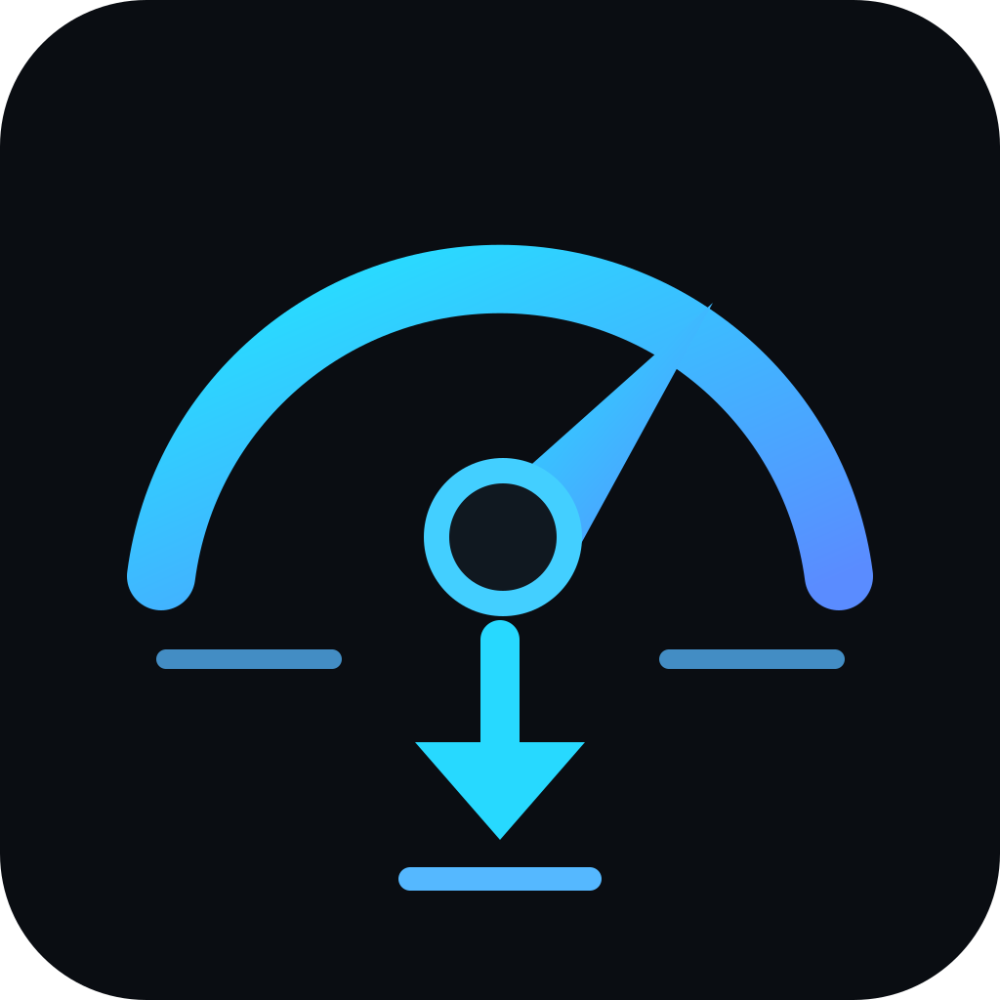

# NOEMA TV Speed Limiter

  

A lightweight Android TV bandwidth limiter for travel, rehab, hotels, mobile hotspots and other metered connections.

NOEMA uses Android's local `VpnService` only as a traffic-control path. It does **not** send your traffic through an external VPN server. A local SOCKS5/tun2socks path forwards traffic directly through the device's physical network and applies a download rate limit.

## Profiles

- **2 Mbit/s Saver** — maximum data saving
- **4 Mbit/s Balanced** — general streaming
- **6 Mbit/s Comfort** — higher quality / more headroom
- **Full Speed Home** — disables the limiter completely

The limiter is device-wide. Upload is currently unrestricted.

## Easy installation on Xiaomi / Android TV

1. Download the latest `NOEMA-TV-Speed-Limiter.apk` to an Android phone.
2. Install **Send Files to TV** on both the phone and the Android TV / Xiaomi TV Stick.
3. Open **Send Files to TV** on the TV and choose **Receive**.
4. On the phone choose **Send**, select the NOEMA APK and send it to the TV.
5. Open the received `.apk` on the TV.
6. If Android asks for permission to install unknown apps, allow it for the file-transfer/file-manager app you are using.
7. Install **NOEMA TV Speed Limiter**.
8. Start NOEMA and choose 2, 4 or 6 Mbit/s.
9. Android shows a one-time VPN permission dialog. Accept it. This is required because NOEMA uses the local Android VPN interface for traffic shaping; no external VPN service is used.
10. Open YouTube, Waipu, Netflix or another app and test playback.

To return to unrestricted internet, open NOEMA and select **Full Speed Home**.

## Diagnostics

NOEMA includes a built-in **Diagnostics** screen for troubleshooting without ADB. It shows:

- Android/API version
- selected physical network and DNS
- local SOCKS listener
- TUN status and MTU
- HEV tun2socks status
- SOCKS connection count
- TCP success/failure counters
- UDP association and packet counters
- traffic counters
- last detected networking error

Diagnostics stay on the device and are shown locally in the app.

## Privacy

NOEMA has no account system, no analytics and no remote telemetry. The app does not require a third-party VPN server. Network traffic is forwarded directly to the internet through the device's physical network.

## Compatibility

- Android 8.0+ / API 26+
- Android TV / Google TV
- Tested during development on Xiaomi Mi TV Stick, Android 9 / API 28

## Technical design

`App traffic -> Android VpnService TUN -> HEV tun2socks -> local SOCKS5 relay -> physical Wi-Fi/mobile network`

The download shaper uses a process-wide token bucket so multiple simultaneous connections share one configured download budget without allowing a single large stream to reserve long periods of future bandwidth.

## Open-source components

NOEMA uses the HEV tun2socks implementation through `com.wgtunnel:hevtunnel`. HEV is licensed under the MIT License.

## Status

`1.0-final01` is the first public-release candidate. A GitHub Release should only be published after the real-device streaming test passes with the limiter enabled.
